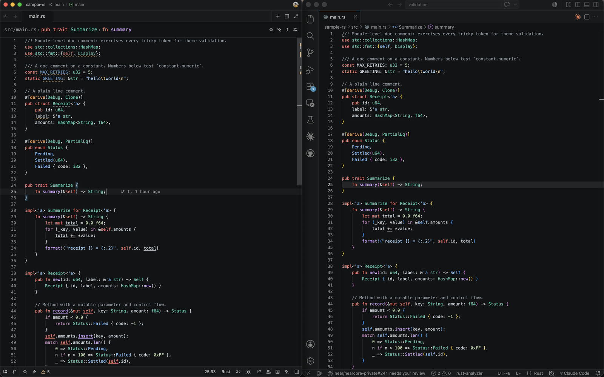
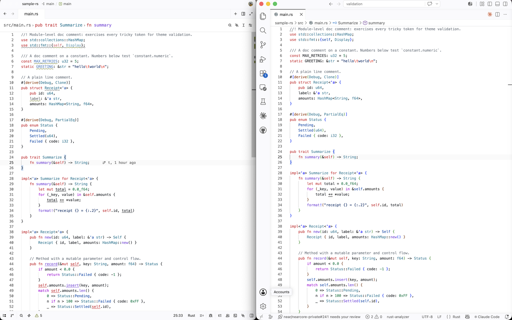

# VSCode 2026 for Zed

A faithful port of Visual Studio Code's default **Dark 2026** and **Light 2026**
themes to Zed. Two themes ship in this extension:

- **VSCode 2026 Dark**
- **VSCode 2026 Light**

Install it, pick the theme, done — no configuration required.



*Left: Zed with **VSCode 2026 Dark**. Right: VS Code's built-in **Dark 2026** — same file, same colors.*



*Left: Zed with **VSCode 2026 Light**. Right: VS Code's built-in **Light 2026**.*

## Install

Open the command palette → **zed: extensions**, search for **VSCode 2026**, and
click **Install**. Then open the theme selector (`cmd-k cmd-t`) and pick
**VSCode 2026 Dark** or **VSCode 2026 Light**.

That's it — the theme looks right with no further setup. Everything below is
optional.

## Optional tweaks

These are editor settings, not part of the theme. Add them to your Zed
`settings.json` (open it with `cmd-,`, or the command palette → **zed: open
settings**).

### Match VS Code's editor font

For a look closer to VS Code's default editor, match its font and line spacing:

```json
{
  "buffer_font_family": "Menlo",
  "buffer_line_height": { "custom": 1.5 }
}
```

`Menlo` is VS Code's default monospace font on macOS — use `Consolas` on Windows
or your preferred monospace family on Linux.

### Closer color matching

For the closest match to VS Code (e.g. coloring enum members the way VS Code
does), add this for the languages you use:

```json
{
  "languages": {
    "Rust":       { "semantic_tokens": "combined" },
    "TypeScript": { "semantic_tokens": "combined" },
    "Python":     { "semantic_tokens": "combined" }
  }
}
```

Leave it out and the theme still looks great.

### Match VS Code's semantic coloring (advanced)

VS Code applies a few colors, driven by language-server semantic tokens, that
Zed's defaults don't. To match them, enable `semantic_tokens` (see above) and
add these rules to your `settings.json`:

```json
{
  "global_lsp_settings": {
    "semantic_token_rules": [
      { "token_type": "keyword", "token_modifiers": ["controlFlow"], "style": ["keyword.control"] },
      { "token_type": "derive", "style": ["type"] },
      { "token_type": "enumMember", "style": ["variant"] },
      { "token_type": "namespace", "style": ["namespace"] },
      { "token_type": "selfKeyword", "style": ["keyword"] }
    ]
  }
}
```

- **controlFlow** turns control-flow keywords (`if`, `match`, `return`, …) purple instead of coral.
- **derive** turns derived trait names (`Debug`, `Clone`, …) inside `#[derive(...)]` teal instead of orange.
- **enumMember** colors enum members (`Color::Red`) blue at use sites, not just where they're declared.
- **namespace** colors module/namespace paths teal.
- **selfKeyword** colors `self` like a keyword.

Each rule points at one of the theme's own colors (`style: [...]`) rather than a
fixed hex, so it stays correct in both the dark and light variants.

## Known differences from VS Code

A few things Zed can't match exactly:

- **Rainbow brackets.** Zed doesn't color nested brackets by depth, so they all use one color.
- **Some TypeScript keywords** — `extends`, `implements`, `readonly`, `public`, `static` — share one color here instead of VS Code's three.
- **Python and Go control flow.** `if` / `for` / `return` share the general keyword color.
- **Markdown block quotes** use the default text color.

## Building from source

To try the theme before installing from the marketplace, clone this repo, then
in Zed run the command palette → **zed: install dev extension** and select the
cloned directory.

## License

MIT — see [LICENSE](LICENSE).
